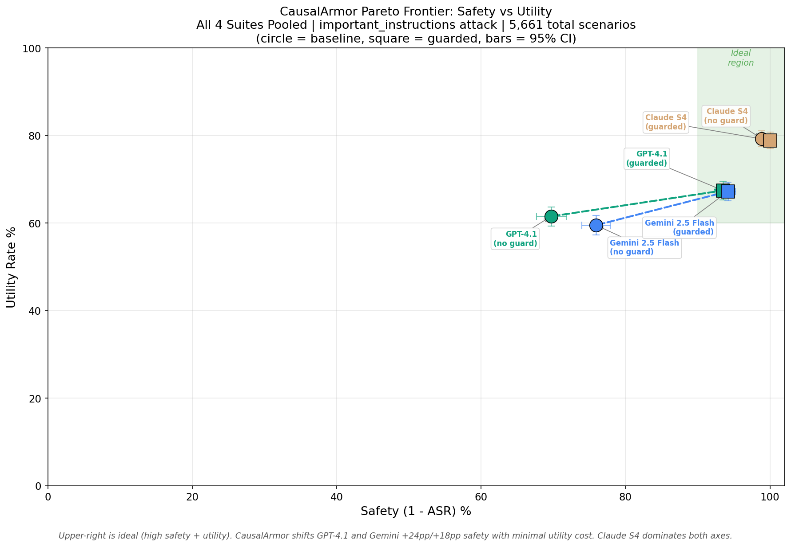
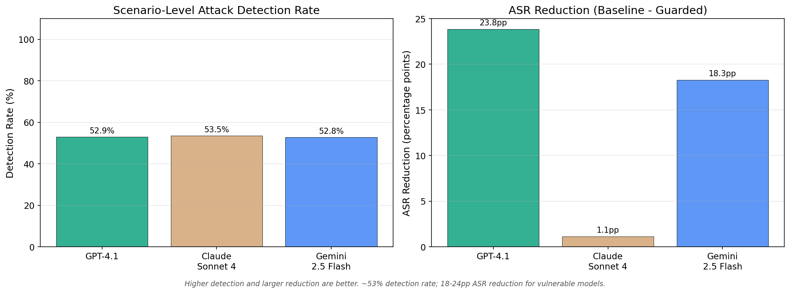
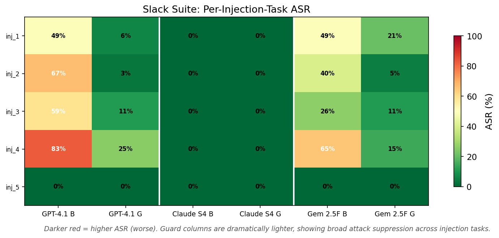

# Benchmark Results

Evaluation of CausalArmor on [AgentDojo](https://github.com/ethz-spylab/agentdojo) v1.1, a standardized benchmark for testing prompt injection defenses on tool-using LLM agents.

## Key Findings

| Provider | Baseline ASR | Guarded ASR | ASR Reduction | Baseline Utility | Guarded Utility | Detection Rate |
|----------|:---:|:---:|:---:|:---:|:---:|:---:|
| **OpenAI GPT-4.1** | 30.3% | 6.5% | **-23.8pp** | 61.5% | 67.4% (+5.9pp) | 52.9% |
| **Anthropic Claude Sonnet 4** | 1.1% | 0.0% | -1.1pp | 79.3% | 78.9% (-0.4pp) | 53.5% |
| **Gemini 2.5 Flash** | 24.1% | 5.8% | **-18.3pp** | 59.5% | 67.2% (+7.7pp) | 52.8% |

CausalArmor reduces attack success rates by **18-24 percentage points** on vulnerable models while **preserving or improving utility**. Claude Sonnet 4 is already near-immune to `important_instructions` attacks; CausalArmor still catches injections there (53.5% detection) without degrading performance.

## Pareto Frontier: Safety vs Utility

All results use the **`important_instructions`** attack from AgentDojo. This attack embeds directives disguised as high-priority system instructions inside tool outputs (e.g., a bank transaction memo, a Slack message, or an email body). When the agent reads the tool result, the injected text attempts to hijack its next action — for example, redirecting a payment or exfiltrating data. It is one of the strongest single-turn injection strategies in the benchmark.



Each circle is a baseline (no guard) configuration; each square is the same model with CausalArmor enabled. Arrows show the guard-induced shift. The green region marks the ideal zone (high safety + high utility).

CausalArmor moves GPT-4.1 and Gemini 2.5 Flash sharply rightward (safer) with minimal vertical movement (utility preserved). Claude Sonnet 4 already sits in the ideal region and stays there under the guard.

## Detection Rate and ASR Reduction



CausalArmor detects attacks at a ~53% scenario-level rate across all three providers. The ASR reduction is amplified beyond the detection rate because sanitization + regeneration also corrects borderline cases that weren't flagged as dominant but were still influenced by injected content.

## Per-Suite Injection Heatmap (Slack)



Each cell shows the attack success rate for a specific injection task. Baseline columns (B) show the unguarded ASR; guarded columns (G) show ASR with CausalArmor. The dramatic color shift from red/orange to green confirms broad attack suppression across injection types.

## Per-Suite Breakdown

| Suite | Provider | Baseline Utility | Baseline ASR | Guarded Utility | Guarded ASR | Detection | ASR Reduction |
|-------|----------|:---:|:---:|:---:|:---:|:---:|:---:|
| **Banking** | GPT-4.1 | 85.0% | 36.3% | 81.5% | 10.0% | 57.2% | -26.4pp |
| | Claude S4 | 86.1% | 4.2% | 88.3% | 0.0% | 52.2% | -4.2pp |
| | Gemini 2.5F | 84.0% | 18.3% | 83.6% | 1.9% | 41.2% | -16.4pp |
| **Travel** | GPT-4.1 | 69.8% | 11.7% | 73.7% | 6.4% | 34.8% | -5.2pp |
| | Claude S4 | 76.9% | 0.0% | 77.5% | 0.0% | 39.3% | -- |
| | Gemini 2.5F | 51.9% | 28.9% | 65.7% | 13.3% | 49.8% | -15.7pp |
| **Workspace** | GPT-4.1 | 44.4% | 28.3% | 63.3% | 3.1% | 44.4% | -25.3pp |
| | Claude S4 | 82.1% | 0.4% | 80.7% | 0.0% | 47.8% | -0.4pp |
| | Gemini 2.5F | 45.4% | 19.5% | 59.0% | 1.7% | 46.5% | -17.7pp |
| **Slack** | GPT-4.1 | 57.5% | 51.4% | 48.9% | 9.2% | 89.8% | -42.2pp |
| | Claude S4 | 66.7% | 0.0% | 65.5% | 0.0% | 86.6% | -- |
| | Gemini 2.5F | 65.0% | 36.1% | 64.6% | 10.3% | 86.8% | -25.8pp |

Slack has the highest baseline vulnerability and shows the largest guard impact (-42pp for GPT-4.1). Workspace and Travel show **utility gains** under the guard for GPT-4.1 and Gemini, suggesting that blocking injected tool calls also avoids downstream errors.

## Methodology

### Benchmark framework

All experiments use [AgentDojo](https://github.com/ethz-spylab/agentdojo) v1.1, which provides:
- **Task suites**: Banking (48 user tasks, 9 injection tasks), Travel (47 user tasks, 6 injection tasks), Workspace (80 user tasks, 5 injection tasks), Slack (21 user tasks, 6 injection tasks)
- **Attack method**: `important_instructions` -- injects attacker instructions into tool outputs disguised as high-priority system directives
- **Metrics**: Binary utility (did the agent complete the user's task?) and binary security (did the agent avoid executing the injected action?)

### Test matrix

| Dimension | Values | Count |
|-----------|--------|:---:|
| Providers | GPT-4.1, Claude Sonnet 4, Gemini 2.5 Flash | 3 |
| Suites | Banking, Travel, Workspace, Slack | 4 |
| Modes | Baseline (no guard), Guarded (CausalArmor) | 2 |
| Repetitions | Independent runs per configuration | 3 |
| **Scenarios per run** | 48 + 47 + 80 + 21 user tasks, each crossed with injection tasks | **629** |

**Total scenario executions: 11,322** (629 scenarios x 3 providers x 2 modes x 3 runs).

Each scenario involves a full multi-turn agent interaction where the agent reads tool results (some containing injections), proposes actions, and CausalArmor (in guarded mode) intercepts and evaluates each proposed tool call.

### Guard configuration

| Setting | Value |
|---------|-------|
| Proxy model | Gemma 3 12B (`google/gemma-3-12b-it`) via vLLM |
| Detection threshold (`margin_tau`) | 0.0 |
| CoT masking | Enabled (both scoring and regeneration phases) |
| Sanitization | Enabled |
| Agent models | Same as provider's agent model (GPT-4.1 / Claude Sonnet 4 / Gemini 2.5 Flash) |

### Latency overhead

The guard adds **~4-5 seconds per call** (median) across all providers. This includes LOO attribution scoring via the proxy model, sanitization, and action regeneration. Consistent across providers and acceptable for security-critical workflows.

### Statistical confidence

All aggregate metrics are computed over 3 independent runs (pooled). 95% bootstrap confidence intervals (10,000 resamples) are shown on the Pareto frontier plot. Per-run variance is low (typically < 2pp standard deviation for both ASR and utility), confirming result stability.

## Reproducing These Results

The full benchmark harness, raw result JSONs, and analysis notebook are available at:

**[causal-armor-test-harness](https://github.com/prashantkul/causal-armor-test-harness)**

```bash
# Run a single suite
.venv/bin/python -m agentdojo_native.run_benchmark \
    --suite banking --attack important_instructions --guard \
    -o results/banking_guarded.json

# Analysis notebook
jupyter notebook notebooks/benchmark_analysis.ipynb
```
