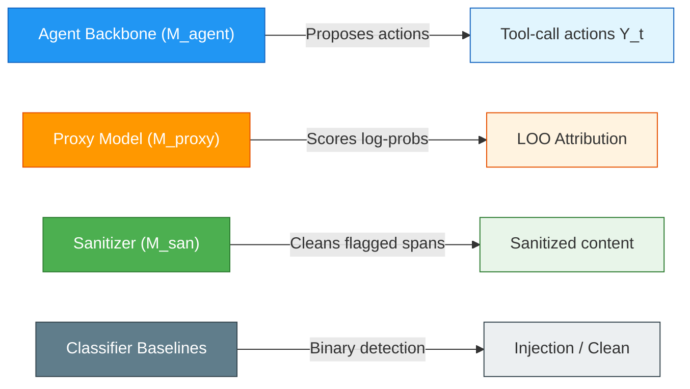
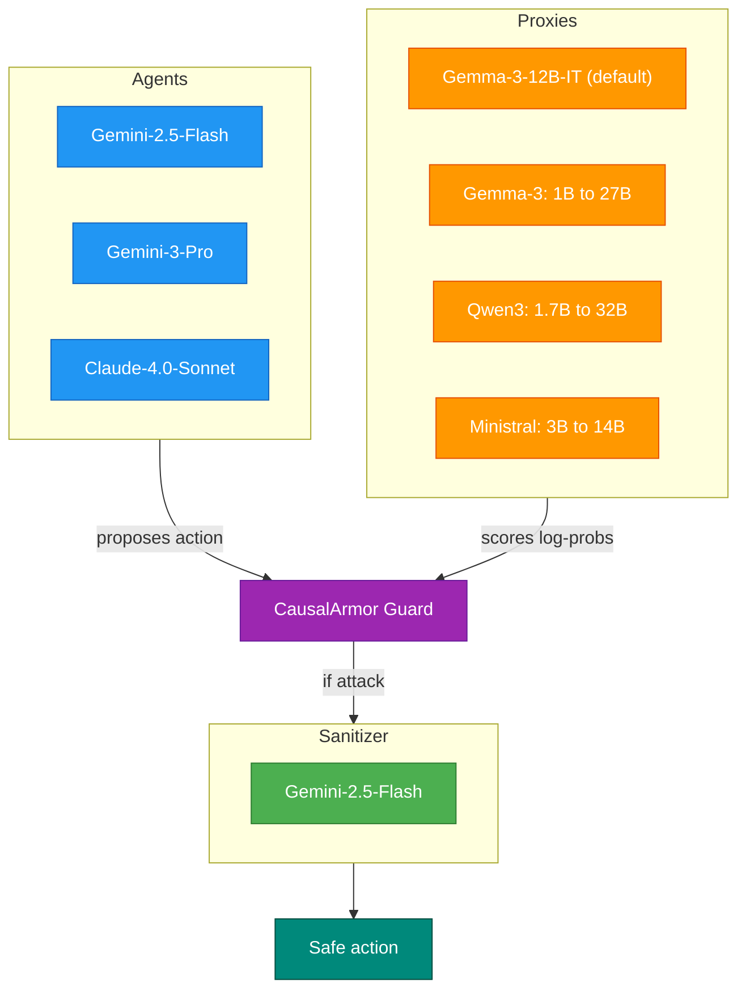
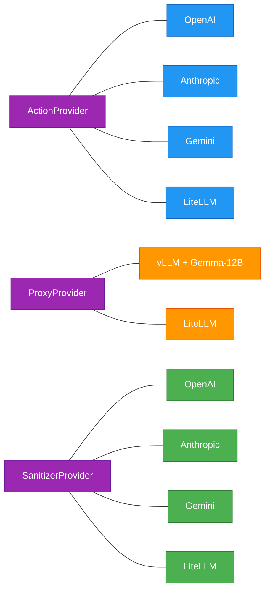

# Paper Models Reference

Models used in the CausalArmor paper (arXiv:2602.07918) and their roles.

## Model Roles in CausalArmor

## Agent Backbones (M_agent)

The main LLM agents being defended — CausalArmor sits in front of these.

| Model | Role |
|-------|------|
| **Gemini-2.5-Flash** | Default agent backbone across all experiments |
| **Gemini-3-Pro** | Stronger backbone for generalizability testing |
| **Claude-4.0-Sonnet** | Cross-family generalizability testing |

## Proxy Models (M_proxy)

Lightweight models for LOO attribution scoring, served via vLLM. The proxy model never generates text — it only scores log-probabilities.

### Default
| Model | Notes |
|-------|-------|
| **Gemma-3-12B-IT** | Default proxy, best Pareto trade-off (latency vs. security) |

### Proxy size ablation (Gemma-3 family)
| Model | Size | Detection reliability |
|-------|------|---------------------|
| Gemma-3-1B | 1B | Unreliable |
| Gemma-3-4B | 4B | Partial |
| **Gemma-3-12B-IT** | 12B | Near-perfect |
| Gemma-3-27B | 27B | Near-perfect |

### Proxy family ablation
| Family | Sizes tested |
|--------|-------------|
| **Qwen3** | 1.7B, 4B, 8B, 14B, 32B |
| **Ministral** | 3B, 8B, 14B |

### Key finding

> Models above **8B** reliably detect IPI attacks. **12B+** achieve near-perfect detection. Same-family proxies (Gemma for Gemini agents) are most **Pareto-optimal** for latency vs. security.

## Sanitizer (M_san)

Rewrites flagged untrusted spans to remove injected instructions while preserving factual data.

| Model | Notes |
|-------|-------|
| **Gemini-2.5-Flash** | Fixed across all experiments |

The sanitizer is the most expensive step (full generation call), which is why CausalArmor only triggers it when an attack is detected — keeping the common case (benign traffic) fast.

## Trained Classifier Baselines

Used for comparison against CausalArmor's causal attribution approach.

| Model | Type | Source |
|-------|------|--------|
| **DeBERTa-v3-base-prompt-injection-v2** | Binary injection detector | [HuggingFace](https://huggingface.co/protectai/deberta-v3-base-prompt-injection-v2) |
| **PIGuard** | Injection guardrail classifier | [HuggingFace](https://huggingface.co/leolee99/PIGuard) |

## Other Roles

| Model | Role |
|-------|------|
| **Gemini-2.5-Flash** | User Simulator in DoomArena's conversational setting |
| **Gemini-2.5-Flash** | Adversarial LLM attacker in DoomArena |
| **Gemini-3-Pro** | Generated the two novel attack templates (`task_dependency`, `tool_output_hijack`) |

## Mapping to CausalArmor Code

| Paper role | Protocol | Recommended provider | Config |
|-----------|----------|---------------------|--------|
| M_agent | `ActionProvider` | OpenAI / Anthropic / Gemini / LiteLLM | `OPENAI_ACTION_MODEL`, etc. |
| M_proxy | `ProxyProvider` | `VLLMProxyProvider` with Gemma-3-12B-IT | `VLLM_BASE_URL`, `VLLM_MODEL` |
| M_san | `SanitizerProvider` | OpenAI / Anthropic / Gemini / LiteLLM | `OPENAI_SANITIZER_MODEL`, etc. |
