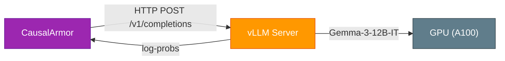
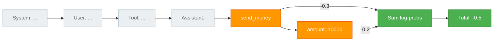
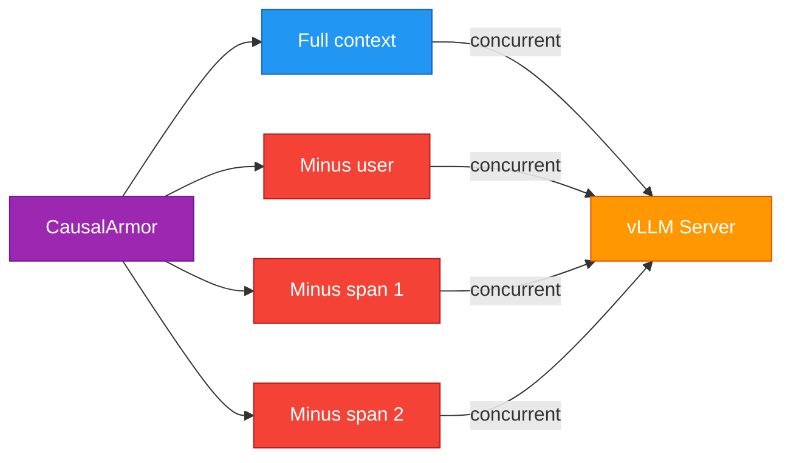
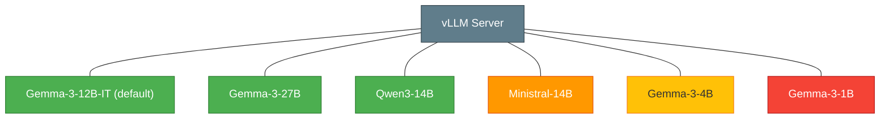

# vLLM Setup Guide for CausalArmor

CausalArmor uses a **proxy model** to score log-probabilities for LOO (Leave-One-Out) causal attribution. The paper recommends [vLLM](https://github.com/vllm-project/vllm) serving **Gemma-3-12B-IT** as the proxy model.



## 1. Install vLLM

```bash
pip install vllm
```

**Requirements:**
- CUDA-capable GPU (NVIDIA)
- At least 24GB VRAM for Gemma-3-12B-IT (A100 40GB recommended)
- Python 3.10+

## 2. Download and serve the model

```bash
# Serve Gemma-3-12B-IT with OpenAI-compatible API
vllm serve google/gemma-3-12b-it \
    --host 0.0.0.0 \
    --port 8000 \
    --dtype auto \
    --max-model-len 8192
```

Verify the server is running:

```bash
curl http://localhost:8000/v1/models
```

## 3. Configure CausalArmor

### Via environment variables (recommended)

Set these in your `.env` (loaded automatically by causal-armor):

```bash
CAUSAL_ARMOR_PROXY_BASE_URL=http://localhost:8000
CAUSAL_ARMOR_PROXY_MODEL=google/gemma-3-12b-it
```

Then instantiate with zero args — the provider reads from env:

```python
from causal_armor import CausalArmorMiddleware, CausalArmorConfig
from causal_armor.providers.vllm import VLLMProxyProvider

middleware = CausalArmorMiddleware(
    action_provider=your_action_provider,
    proxy_provider=VLLMProxyProvider(),
    sanitizer_provider=your_sanitizer_provider,
    config=CausalArmorConfig(margin_tau=0.0),
)
```

### Via explicit constructor args

Constructor args always take precedence over env vars:

```python
proxy = VLLMProxyProvider(
    base_url="http://localhost:8000",
    model="google/gemma-3-12b-it",
)
```

## 4. Verify the setup

After starting vLLM, verify it returns logprobs correctly:

```bash
curl -s http://localhost:8000/v1/completions \
  -H "Content-Type: application/json" \
  -d '{
    "model": "google/gemma-3-12b-it",
    "prompt": "User: Book a flight to Paris\nAssistant: Sure, booking flight AA123.",
    "max_tokens": 0,
    "echo": true,
    "logprobs": 1
  }' | python -m json.tool
```

You should see a response with `token_logprobs`, `tokens`, and `text_offset` arrays. Example output:

```
Token                   LogProb  Offset
──────────────────── ──────────  ──────
'<bos>'                    None       0
'User'                 -13.464       5
':'                    -10.018       9
' Book'                -15.181      10
' a'                    -0.429      15
' flight'               -0.667      17
...
```

The first token (`<bos>`) has `None` logprob (no prior context). All subsequent tokens should have valid negative logprob values. This is exactly what CausalArmor sums over the action tokens for LOO attribution.

## 5. How the proxy scoring works

CausalArmor calls vLLM's `/v1/completions` endpoint (not chat) with:

```json
{
    "model": "google/gemma-3-12b-it",
    "prompt": "<context + action_text>",
    "max_tokens": 0,
    "echo": true,
    "logprobs": 1
}
```

- `max_tokens=0` — no generation, just scoring
- `echo=true` — returns logprobs for the entire input including the prompt
- `logprobs=1` — returns top-1 log-probability per token

The provider then sums log-probabilities for **action tokens only** (skipping prompt tokens using `text_offset`).



## 6. Performance tips

### Batch size

LOO attribution makes `2 + |S_t|` concurrent proxy calls per decision point (full context + user-ablated + one per untrusted span). All calls run in parallel through vLLM:



Use `max_loo_batch_size` to cap concurrency:

```python
config = CausalArmorConfig(
    max_loo_batch_size=8,  # max 8 concurrent vLLM calls
)
```

### GPU memory

| Model | VRAM (FP16) | VRAM (INT8) |
|-------|-------------|-------------|
| Gemma-3-4B-IT | ~8GB | ~4GB |
| Gemma-3-12B-IT | ~24GB | ~12GB |
| Gemma-3-27B-IT | ~54GB | ~27GB |

For lower VRAM, use quantization:

```bash
vllm serve google/gemma-3-12b-it \
    --quantization awq \
    --dtype float16
```

### Multiple GPUs

```bash
vllm serve google/gemma-3-12b-it \
    --tensor-parallel-size 2
```

### Request timeout

For large contexts, increase the timeout:

```python
proxy = VLLMProxyProvider(
    base_url="http://localhost:8000",
    model="google/gemma-3-12b-it",
    timeout=60.0,  # seconds
)
```

## 7. Alternative proxy models

While the paper uses Gemma-3-12B-IT, any model served by vLLM that supports logprobs works. The paper tested several families:



```bash
# Llama-based proxy
vllm serve meta-llama/Llama-3.1-8B-Instruct --port 8000

# Mistral-based proxy
vllm serve mistralai/Mistral-7B-Instruct-v0.3 --port 8000
```

Update the provider accordingly:

```python
proxy = VLLMProxyProvider(
    base_url="http://localhost:8000",
    model="meta-llama/Llama-3.1-8B-Instruct",
)
```
